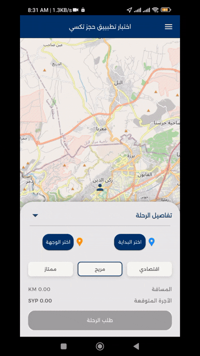

# Taxi Booking App

*A modern taxi booking app built with Flutter, GetX, OSM Maps, localization & dark theme support.*

[](https://github.com/abd-Mohsen/taxi_booking_app/actions/workflows/flutter-ci.yml)

---

## Demo



---

## Features

- OSM Map integration (live location, driver markers)
- GetX state management + dependency injection
- Responsive UI with Material 3
- Dark & Light theme toggle
- Multi-language localization (en, ar)
- Modular controllers & services
- Driver info bottom sheet
- Trip selection panel
- Drawer with settings
- driver accepted page with ETA

---

## Project Architecture

This project follows a **clean, predictable, MVC architecture**:

```
lib/
 ├─ controllers/           # GetX controllers (Home, TaxiData, Location, Theme…)
 ├─ models/                # Pure data models (TaxiDataModel, DriverModel…)
 ├─ services/              # API & data sources (TaxiDataService)
 ├─ views/                 # UI screens (HomePage, components…)
 │    ├─ components/       # Drawer, sheets, tiles, widgets
 ├─ locale                 # Localization JSON files
 ├─ themes                 # Light/Dark theme config
 ├─ main.dart              # App entry point, dependency injection, GetMaterialApp
```

### Why this structure?

* **Separation of concerns**: UI, logic, and data are cleanly split.
* **Easy testing**: controllers and services are unit-test friendly.
* **Scalable**: features can grow without refactoring the core.
* **Clear GetX usage**:

  * `Get.put()` for initialization
  * `GetBuilder` for UI updates
  * Centralized routes & translations

---

## Getting Started

### 1- Clone the repository

```bash
git clone https://github.com/abd-Mohsen/taxi_booking_app.git
cd taxi_booking_app
```

### 2- Install dependencies

```bash
flutter pub get
```

### 3- Run the app

```bash
flutter run
```

---


## Future Improvements

* Real-time driver tracking (WebSockets)
* Payment integration
* Ride history
* Notifications
* Better map mocking for widget tests

## Download APK

You can download the latest APK from GitHub Actions artifacts

**[open the latest workflow](https://github.com/abd-mohsen/taxi_booking_app/actions)**
